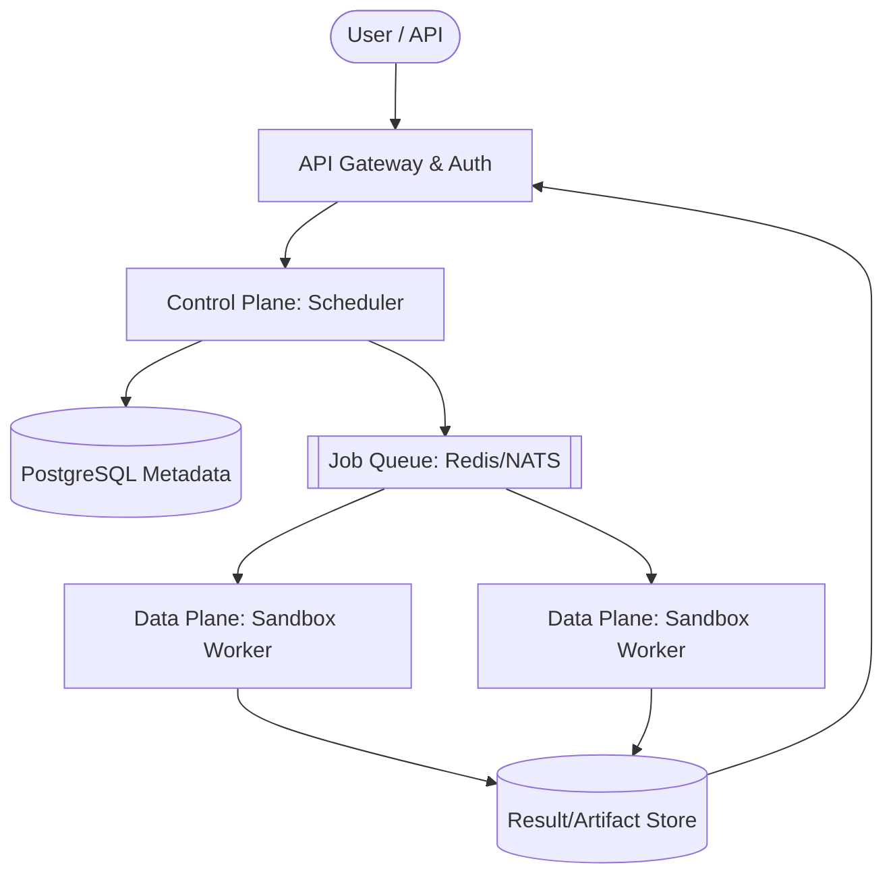

# AgentGuard Scale-Out Architecture

## Control Plane / Data Plane Separation

AgentGuard is currently a single-node system. To scale out, the architecture must transition to a decoupled control plane and data plane model:

*   **Control Plane**: Responsible for API gateway routing, authentication, scheduling, workflow management, and metadata storage (e.g., PostgreSQL).
*   **Data Plane**: Responsible for workload execution, consisting of sandbox workers, git cloners, and command executors.
*   **Communication**: Communication between the control plane and data plane will be handled via a high-performance job queue (Redis or NATS) and a result store (e.g., S3/MinIO for artifacts).

## Isolation Tiers

Security and isolation will be provided through progressive tiers:

*   **Tier 1 (Current)**: Process-level isolation with strict allowlists (`shell=False`, argument vectors).
*   **Tier 2 (Planned)**: Container-level isolation using Docker with restricted seccomp profiles, AppArmor, and dropped capabilities.
*   **Tier 3 (Future)**: VM-level isolation using gVisor (runsc) or Firecracker microVMs for strong kernel separation and multi-tenant safety.

## Ephemeral Sandboxes

To prevent state bleed and cache poisoning across workflows:
*   Each workflow is assigned a completely fresh, ephemeral sandbox.
*   The sandbox is aggressively destroyed immediately after workflow completion or cancellation.
*   Workspaces can be restored via content-addressed snapshots (e.g., CAS trees) for reproducibility and auditing.

## Per-Workflow Cost Accounting

Multi-tenant environments require strict resource limits and billing:
*   **CPU Time**: Tracked via execution `duration_ms` (already partially implemented).
*   **Disk Usage**: Monitored via workspace quotas per tenant.
*   **Network Bandwidth**: Tracked via egress limits on the sandbox interface.
*   **Cost Model**: Calculated using a per-second CPU billing plus per-MB storage over the workflow lifecycle.

## Cache Poisoning Prevention

Dependency caches (e.g., `npm`, `pip`, `.git`) are common targets for supply chain attacks:
*   Separate dependency caches will be strictly maintained per tenant.
*   Hash verification will be enforced on all cached artifacts prior to restoration.
*   TTL-based cache invalidation will be implemented to prevent stale vulnerabilities from persisting.

## Multi-Region / HA

For high availability across zones:
*   **Active-Active Deployment**: Geo-routing (e.g., via Cloudflare) to the nearest available region.
*   **Distributed Locking**: Exactly-once job claim semantics using distributed locks (e.g., Redis Redlock) to prevent split-brain execution.
*   **PostgreSQL**: High availability via primary-replica replication and read replicas for dashboard queries.
